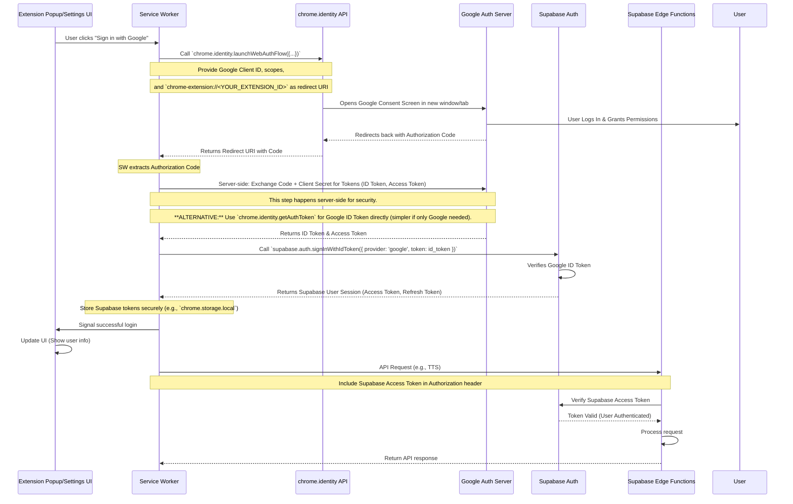

# 08: Authentication Flow (Supabase Google Sign-In for Chrome Extension)

This document describes the process for authenticating users within the Chrome Extension using Google Sign-In provided by Supabase Auth.

## Overview

Supabase Auth supports OAuth providers like Google. For Chrome Extensions (Manifest V3), the standard web OAuth redirect flow isn't directly applicable. Instead, we use Chrome's `identity` API to initiate the OAuth flow and retrieve an ID token, which is then passed to Supabase for session creation.

## Authentication Flow Steps



**Detailed Steps:**

1.  **Setup Google Cloud Project:**
    *   Create a Google Cloud project.
    *   Configure the OAuth consent screen.
    *   Create OAuth 2.0 Client IDs:
        *   One of type **Web application**. Record the Client ID and Client Secret. Configure Authorized JavaScript origins (`https://<YOUR_SUPABASE_REF>.supabase.co`) and Authorized redirect URIs (`https://<YOUR_SUPABASE_REF>.supabase.co/auth/v1/callback`).
        *   One of type **Chrome App**. Record the Client ID. Set the Application ID to your Chrome Extension ID (`chrome-extension://<YOUR_EXTENSION_ID>`).
2.  **Configure Supabase Auth:**
    *   In your Supabase project settings, go to Auth -> Providers.
    *   Enable the Google provider.
    *   Enter the **Web application** Client ID and Client Secret obtained in Step 1.
    *   Ensure the Supabase redirect URI (`https://<YOUR_SUPABASE_REF>.supabase.co/auth/v1/callback`) is listed.
3.  **Manifest Permissions (`manifest.json`):**
    *   Add the `identity` permission:
        ```json
        "permissions": [
          "identity",
          "storage"
          // ... other permissions
        ]
        ```
    *   Declare the OAuth Client ID used by the extension (the **Chrome App** Client ID):
        ```json
        "oauth2": {
          "client_id": "<YOUR_CHROME_APP_OAUTH_CLIENT_ID>.apps.googleusercontent.com",
          "scopes": [
            "openid",
            "email",
            "profile"
          ]
        }
        ```
4.  **Initiate Login (Extension UI/Popup):**
    *   A button or link triggers the login process.
    *   It sends a message to the Background Service Worker to start the flow.
5.  **Launch Auth Flow (Service Worker):**
    *   The Service Worker uses `chrome.identity.getAuthToken({ interactive: true })`.
    *   This API handles the user interaction, consent screen, and retrieval of a Google OAuth token (specifically an **ID Token** if using the `openid`, `email`, `profile` scopes declared in the manifest).
    *   Using `getAuthToken` is generally preferred over `launchWebAuthFlow` for Google Sign-In within extensions as it's simpler and designed for this purpose, directly providing the ID token.
    ```typescript
    // In Service Worker (background.ts)
    import { createClient } from '@supabase/supabase-js';

    const supabase = createClient(SUPABASE_URL, SUPABASE_ANON_KEY);

    chrome.runtime.onMessage.addListener((message, sender, sendResponse) => {
      if (message.action === 'googleSignIn') {
        chrome.identity.getAuthToken({ interactive: true }, (token) => {
          if (chrome.runtime.lastError || !token) {
            console.error('Google Sign-In Failed:', chrome.runtime.lastError);
            sendResponse({ success: false, error: chrome.runtime.lastError?.message || 'No token received' });
            return;
          }

          // We have the Google ID token, sign in to Supabase
          signInToSupabaseWithGoogleToken(token)
            .then(session => sendResponse({ success: true, session }))
            .catch(error => sendResponse({ success: false, error: error.message }));
        });
        return true; // Indicates asynchronous response
      }
    });

    async function signInToSupabaseWithGoogleToken(googleIdToken: string) {
      const { data, error } = await supabase.auth.signInWithIdToken({
        provider: 'google',
        token: googleIdToken,
        // nonce: 'OPTIONAL_NONCE' // Add nonce for replay protection if needed
      });

      if (error) {
        console.error('Supabase Sign-In Error:', error);
        throw error;
      }

      console.log('Supabase Sign-In Success:', data.session);
      // Session tokens (access_token, refresh_token) are now managed by supabase-js client
      // Persist session info if needed, though supabase-js handles it by default
      return data.session;
    }
    ```
6.  **Supabase Sign-In:**
    *   The Service Worker calls `supabase.auth.signInWithIdToken` passing the Google `id_token`.
    *   Supabase Auth verifies the token with Google's public keys.
    *   If valid, Supabase creates a user record (if one doesn't exist) in `auth.users` and returns a Supabase session (access token, refresh token).
7.  **Session Management:**
    *   The `supabase-js` client automatically handles storing the session (typically in `localStorage`, but adapted for extension context, potentially using `chrome.storage.local`).
    *   The client also handles automatic token refreshes.
    *   The SW informs the UI of the successful login.
8.  **Authenticated Requests:**
    *   When the SW needs to call a protected Supabase Edge Function:
        *   It retrieves the current session using `supabase.auth.getSession()`.
        *   It includes the Supabase `access_token` in the `Authorization: Bearer <TOKEN>` header of the `fetch` request to the Edge Function.
    *   The Edge Function uses Supabase middleware or manually verifies the JWT token to authenticate the user.

## Logout Flow

1.  User initiates logout from the UI.
2.  UI sends a message to the SW.
3.  SW calls `supabase.auth.signOut()`.
4.  SW potentially removes the Google token from the cache using `chrome.identity.removeCachedAuthToken({ token: googleIdToken })` (though Supabase sign-out might be sufficient).
5.  Clear any local session state and update the UI.

## Security Considerations

*   **Client Secrets:** Never embed Google Client Secrets in the extension code. The `getAuthToken` flow avoids the need for this on the client.
*   **Token Storage:** Supabase JS handles session storage. Ensure `chrome.storage.local` is used for persistence within the extension environment.
*   **Redirect URIs:** While `getAuthToken` simplifies things, ensure any URIs configured in Google Cloud Console are precise and secure (HTTPS).
*   **State Parameter:** While not explicitly shown in the simplified `getAuthToken` flow, if using `launchWebAuthFlow`, employ the `state` parameter for CSRF protection. 