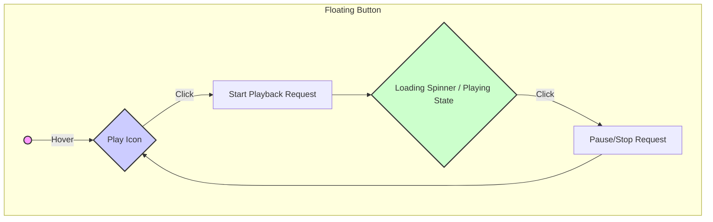

# 12: UI Wireframes & Key Screens

This document provides conceptual wireframes for the key UI elements of the Chrome Extension using Mermaid diagrams and ASCII representations.

## 1. In-Page Floating Action Button (FAB)

**Context:** Appears on pages where readable content is detected.
**Goal:** Provide an immediate entry point to start TTS playback.



**ASCII Representation:**

```
+------------------+
| (Page Content)   |
|                  |
|   +-----+        |
|   |  ▶  | (FAB)  |
|   +-----+        |
|                  |
| (More Content)   |
+------------------+

// Hover/Active State:
+------------------+
| (Page Content)   |
|  ______________  |
| | [||] Loading | |
| |  or Pause   | |
| |_____________| |
| (More Content)   |
+------------------+
```

**Key Elements:**
*   Simple, unobtrusive initial state.
*   Clear visual indication of play/pause/loading status.
*   Positioning should be configurable (e.g., bottom-right, follow scroll) or intelligently placed.

## 2. Extension Action Popup

**Context:** Opened by clicking the extension icon in the Chrome toolbar.
**Goal:** Provide primary controls, status information, and access to settings.

```mermaid
graph TD
    subgraph Action Popup
        A[Logo / App Name] --> B(Status: Idle / Reading / Limit Reached);
        B --> C{Current Page Content Snippet / Title};
        C --> D[Play/Pause Button];
        D --> E[Voice Selection Dropdown];
        E --> F[Speed Control Slider/Buttons];
        F --> G[Usage Indicator (Characters used / Limit)];
        G --> H(Streak Indicator: 🔥 X days);
        H --> I[Settings Gear Icon --> Open Settings Page];
        H --> J[Login/Account Button --> Trigger Auth Flow / Show Account];
    end
```

**ASCII Representation:**

```
+-----------------------------+
| [Logo] Read Aloud Deluxe    |
+-----------------------------+
| Status: Reading nytimes.com |
| Now Playing:                |
| "AI startup announces..."   |
+-----------------------------+
|      ( ▶ Play/Pause || )    |
+-----------------------------+
| Voice: [Kokoro (Female) v]  |
| Speed: [ 1.0x |---|O-| 2.0x] |
+-----------------------------+
| Usage: 8k / 10k chars (Free)|
| Streak: 🔥 5 days           |
+-----------------------------+
| [⚙ Settings]  [👤 Account]  |
+-----------------------------+
```

**Key Elements:**
*   Clear status indication.
*   Essential playback controls (Play/Pause, Voice, Speed).
*   Visibility of usage quota and gamification (streak).
*   Easy access to settings and account/login.

## 3. Settings Page

**Context:** Opened via the gear icon in the Action Popup or Chrome Extensions page.
**Goal:** Allow detailed configuration of voice preferences, account management, subscription, and other options.

```mermaid
graph TD
    subgraph Settings Page (Tabs)
        direction LR
        Tab1[Account] --> P1(Login/Logout Button);
        P1 --> P2(Current Plan: Free/Premium);
        P2 --> P3(Usage: XXX / YYY characters);
        P3 --> P4(Manage Subscription --> Stripe Portal);
        P4 --> P5(Referral Code: [ YOUR-CODE ]);
        P5 --> P6(Enter Referral Code Input);

        Tab2[Voice & Speed] --> V1(Voice Selection Dropdown - Grouped by Lang/Premium);
        V1 --> V2(Speed Control Slider);
        V2 --> V3(Preview Voice Button);

        Tab3[Appearance] --> A1(Highlight Color Picker);
        A1 --> A2(Floating Button Position Radio);

        Tab4[Advanced] --> Ad1(Site Adapter Toggle? - Future);
        Ad1 --> Ad2(Reset Settings Button);
    end
```

**ASCII Representation (Conceptual Tabs):**

```
+-----------------------------------------+
| Settings                                |
+-----------------------------------------+
| [ Account | Voice | Appearance | Advanced ] |
+=========================================+
| **Account**                             |
|   [ Sign In / Out with Google ]         |
|   ------------------------------------- |
|   Plan: Premium (Monthly)               |
|   Usage: 150k / 500k chars              |
|   Renews: Nov 15, 2023                  |
|   [ Manage Subscription (Stripe) ]      |
|   ------------------------------------- |
|   Your Referral Code: HAPPY-READ-123    |
|   [ Copy Code ]                         |
|   Have a code? [___________] [ Apply ]  |
+-----------------------------------------+

+=========================================+
| **Voice & Speed**                       |
|   Default Voice: [Kokoro Premium (US) v]|
|   Playback Speed: [---|O-|] (1.2x)     |
|   [ ▶ Preview Voice ]                   |
+-----------------------------------------+
```

**Key Elements:**
*   Logical grouping of settings (Account, Voice, etc.).
*   Clear indication of current plan and usage.
*   Easy access to Stripe portal for subscription management.
*   Referral code display and input.
*   Detailed voice selection with preview.
*   Customization options (Highlight color, button position).

## 4. Streak Bar / Notification

**Context:** Displayed within the popup or as a temporary notification.
**Goal:** Visually represent the user's current streak.

**ASCII Representation (Popup Element):**

```
+-----------------------------+
| ...                         |
| Streak: 🔥 5 days           |
|         [=======>--] (Goal?)|
| ...                         |
+-----------------------------+
```

**Notification (Chrome Notification API):**

```
+--------------------------------------+
| [App Icon] Streak Milestone!         |
|--------------------------------------|
| You've hit a 7-day reading streak! 🔥 |
| Keep it up!                          |
+--------------------------------------+
```

**Confetti Trigger:** When the `show_confetti` flag is true (received via Realtime), trigger an animation overlaying the popup or settings page briefly. 