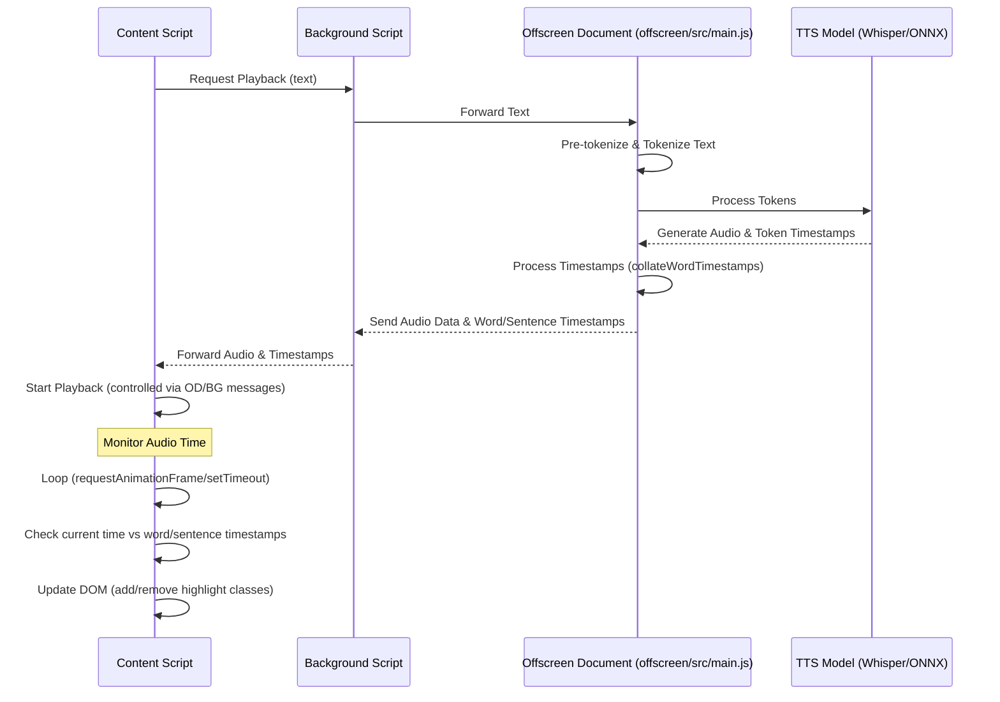

# 03: Timing and Highlighting Synchronization

This document analyzes how the extension synchronizes audio playback with text highlighting for both sentences and words.

## Overview

The extension achieves precise synchronization **without relying on standard browser speech synthesis events** like `onboundary` or media events like `ontimeupdate`. Instead, it leverages **word-level timestamps generated directly by its underlying Text-to-Speech (TTS) model**, which is confirmed to be a Whisper-like model running via ONNX Runtime within the **Offscreen Document**.

## 1. Text Segmentation (Splitting)

Before TTS, the text undergoes several processing steps within the **Offscreen Document** (`offscreen/src/main.js`):

*   **Pre-tokenization**: Initial splitting of raw text using configurable strategies (`WhitespaceSplit`, `Metaspace`, potentially `Split`, `Punctuation`).
*   **Tokenization**: Further splitting into sub-word units suitable for the TTS model, primarily using **BPE (Byte Pair Encoding)**, as evidenced by `Fu` class, `merges`, `bpe_ranks`, etc. (Support for `WordPiece`/`Unigram` also exists).
*   **Segment Boundary Determination**: While pre-tokenization might handle basic splitting, the definitive segmentation into highlightable units (sentences, phrases) and their timing appears to be an **intrinsic part of the ASR/TTS model's processing**. The model, through its understanding of speech patterns or specific control tokens (like timestamp tokens), outputs timed segments.

## 2. Timestamp Generation

The core of the synchronization lies in the TTS model's ability to output timing information within the **Offscreen Document**.

*   **Whisper-like Model**: Confirmed by the presence of `_decode_asr`, `token_timestamps`, `WhisperTimeStampLogitsProcessor`, `combineTokensIntoWords`, and `collateWordTimestamps` within `offscreen/src/main.js`.
*   **ONNX Runtime**: The model runs locally via `onnxruntime-web` inside the Offscreen Document.
*   **Token-Level Timestamps**: The model directly outputs timestamps associated with each generated token (`token_timestamps` variable).
*   **Word-Level Timestamp Aggregation**: The `_decode_asr` function processes these token timestamps when `return_timestamps: "word"` is specified:
    *   It uses helper functions (`combineTokensIntoWords`, `collateWordTimestamps`) to group tokens into words and aggregate their individual timestamps into accurate start/end times for each word.

    ```javascript
    // Simplified logic within _decode_asr in offscreen/src/main.js
    _decode_asr(modelOutput, { return_timestamps: type = false, ... }) {
        const isWordTimestamps = type === 'word';
        let results = [];
        let currentSegment = createNewSegment();
        // ... [Initialization] ...

        for (const chunk of modelOutput) { // Process model output chunks
            // ... [Extract tokens, tokenTimestamps if isWordTimestamps] ...

            for (let i = 0; i < tokens.length; ++i) {
                // ... [Logic to handle text tokens, process/adjust timestamps] ...
                // ... [Logic to handle end-of-segment based on timestamp tokens] ...
            }

            // If segment finished or at the end
            if (/* segment complete */) {
                 // ... [Decode tokens to text] ...

                 if (isWordTimestamps) {
                    // *** Key step: Convert token timestamps to word timestamps ***
                    currentSegment.words = this.collateWordTimestamps(
                        currentSegment.tokens, 
                        currentSegment.timestamps, 
                        currentSegment.language
                    );
                 }
                 results.push(currentSegment);
                 currentSegment = createNewSegment();
            }
        }
        // ... [final processing and formatting] ...
        return [ D: /* full text */, w: /* structured results with timestamps */ ];
    }
    ```

## 3. Highlighting Mechanism

DOM manipulation for highlighting occurs in the **Content Scripts**, driven by data originating from the Offscreen Document.

*   **No `onboundary` / `ontimeupdate`**: The absence of these standard event handlers indicates a custom timing loop.
*   **Timestamp-Driven Updates**: The **Offscreen Document sends messages** (potentially routed via the Background script) to the **Content Script** containing:
    *   Audio data or playback commands.
    *   A structured list of sentences and words with their precise start and end timestamps (derived from `collateWordTimestamps`).
*   **Content Script Logic**: The content script receives this data and manages the highlighting:
    *   It observes the audio playback time.
    *   It uses `requestAnimationFrame` or `setTimeout` loops to check the current audio time against the received word/sentence timestamps.
    *   When the audio time enters the range for a new word or sentence, the script updates the DOM, adding/removing CSS classes (e.g., `.speechify-highlighted-sentence`, `.speechify-highlighted-word`) to the corresponding elements.



This approach allows for highly accurate synchronization, as the highlighting is directly tied to the timing information generated alongside the audio by the model itself.