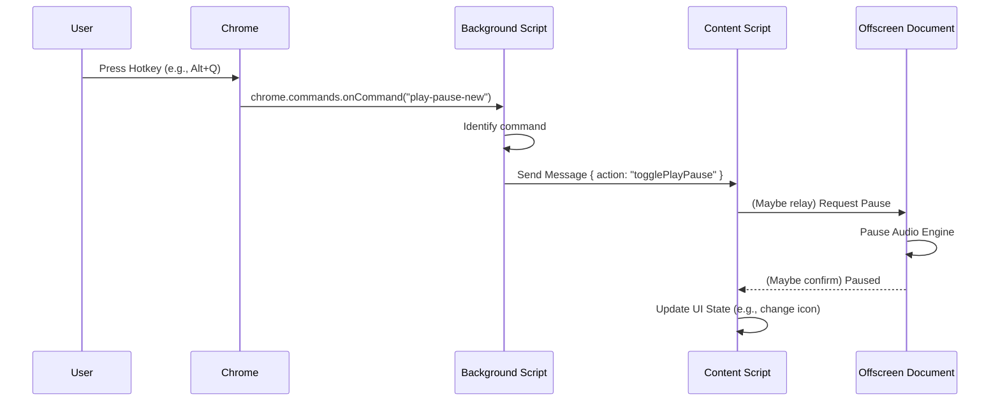

# 05: UI Interaction and Styling

This document analyzes how users interact with the extension's UI elements injected into web pages, including click-to-play, hover effects, and hotkeys.

## 1. Click-to-Play

Users can start playback from a specific sentence or paragraph by clicking on it.

*   **Mechanism**: Text extraction doesn't just get the text but also associates it with references to the original DOM nodes (`content/init-OQBBM3IP.js` mentions `ObjectRef`).
*   **Event Handling**: Click event listeners are attached to the DOM elements representing readable text blocks (or wrappers created around them).
*   **Action**: When a click occurs:
    1.  The event listener identifies the specific text segment (e.g., sentence index or DOM reference) associated with the clicked element.
    2.  An `onClick` handler (seen in components within `content/init-F27DTRWA.js`) is triggered.
    3.  This handler sends a message (likely via the background script) to the audio playback engine (in the Offscreen Document) specifying the desired starting point (e.g., sentence index).
    4.  The audio engine seeks to or restarts playback from that specific point.

    ```javascript
    // Conceptual onClick handler within a content script component
    const handleSentenceClick = (event) => {
      // 1. Identify the sentence/element clicked
      const sentenceRef = getSentenceRefFromElement(event.target);
      if (sentenceRef) {
        // 3. Send message to background/offscreen to start playback from here
        chrome.runtime.sendMessage({ 
          action: "playFromSentence", 
          targetSentence: sentenceRef 
        });
      }
    };
    
    // Simplified Component Rendering
    <div onClick={handleSentenceClick} data-sentence-ref={...}>
      Sentence text...
    </div>
    ```

## 2. Hover UI

Interactive elements appear when the user hovers over text segments.

*   **Hover Play Icon**: A floating play button appears near the text the mouse is currently over.
    *   Implementation: A React/Preact component (`er` button in `content/init-ESVNB32Q.js`, potentially wrapped by a component like `E` in `content/init-F27DTRWA.js`) is dynamically rendered.
    *   Positioning: Uses `position: absolute` and JavaScript to calculate `top`/`left` based on the hovered element's `getBoundingClientRect()`.
    *   Visibility: Controlled using `onMouseEnter` / `onMouseLeave` event listeners on the text elements (or wrappers) to add/remove the icon component from the DOM or toggle its opacity using CSS fade animations (`@keyframes fadeIn`, `@keyframes fadeOut` defined in `content/init-ESVNB32Q.js`).
*   **Tooltips**: Appear on hover over specific icons within the player or other UI elements.
    *   Implementation: Typically an icon/button wrapped in a container div. The tooltip text is in a nested `span`.
    *   Visibility: Uses CSS `:hover` pseudo-class on the container to change the `visibility` or `display` of the absolutely positioned tooltip `span` (e.g., `:hover span { visibility: visible; }` in `content/chunk-Z4JSAUZD.js`).

## 3. Injected CSS and Styling

The extension relies heavily on CSS-in-JS for styling injected elements.

*   **Library**: Uses a library like `styled-components` or `emotion` (indicated by tagged template literal syntax: `S`, `U`, `c`, `de`, `n`, etc. followed by backticks `` ` ``).
*   **Highlighting Styles**:
    *   Sentence/Word Highlighting: Achieved by dynamically adding/removing CSS classes to the corresponding DOM elements based on audio timestamps.
    *   Example (`content/init-QU3EJ6BJ.js`): A class `speechify-marked-active` is defined and injected using `document.styleSheets[0].insertRule` with a style like `{ background: rgba(255, 0, 0, 0.2); }`. Other classes likely exist for word-level highlighting or different states.
*   **Hover Effect Styles**:
    *   Defined using the `:hover` pseudo-class within the component styles.
    *   Common effects include changing `background-color`, text `color`, `border`, or `opacity`.
*   **Theming**: Supports dark/light modes by passing props (`isDarkMode`) to components and using different color sets (`styleThemes` objects in `content/init-F27DTRWA.js`).
*   **Positioning**: Extensive use of `position: absolute` and dynamic `top`/`left` calculations based on target elements and scroll offsets.
*   **Animation**: CSS keyframe animations (`@keyframes fadeIn`, `fadeOut`, `loading` in `content/init-ESVNB32Q.js`) are used for smoother UI transitions.

## 4. Hotkey Handling

Keyboard shortcuts provide quick access to core functions.

*   **Definition**: Hotkeys are defined in `manifest.json` under the `commands` key.
*   **Listener**: The background script (`background/main.js`) listens for the `chrome.commands.onCommand` event.
*   **Execution Flow**:
    1.  User presses a registered hotkey (e.g., `Alt+Q`).
    2.  Chrome triggers the `onCommand` event in the background script with the command name (e.g., `play-pause-new`).
    3.  The background script listener identifies the command.
    4.  It sends a message to the active content script (or the Offscreen Document) instructing it to perform the action (e.g., toggle play/pause, save, start screenshot mode).
*   **UI Display**: Settings UI components (e.g., `$o` in `content/chunk-FJMP4XPS.js`) can fetch the list of commands (likely via a message to the background script) to display the currently assigned shortcuts to the user.

